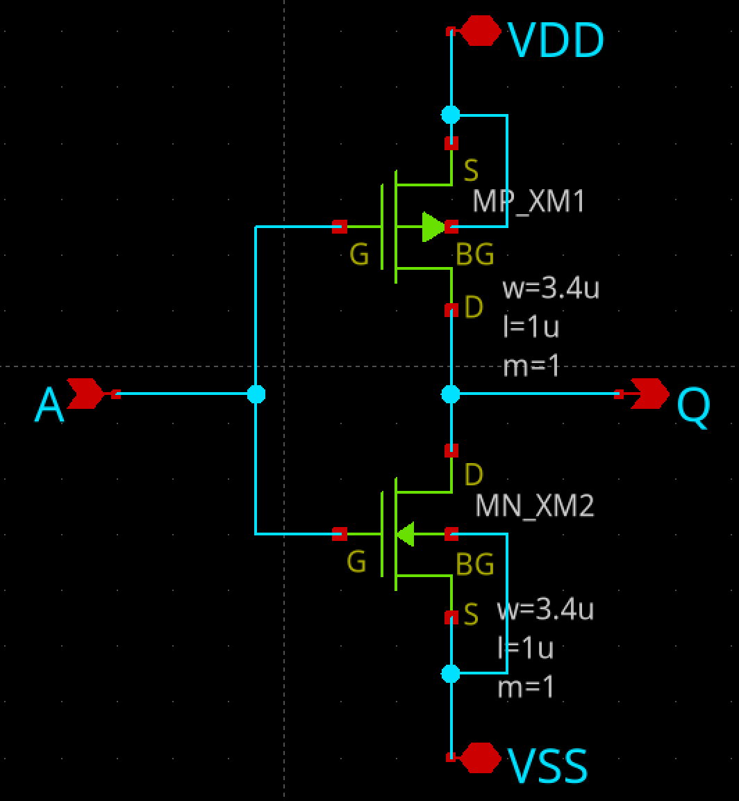
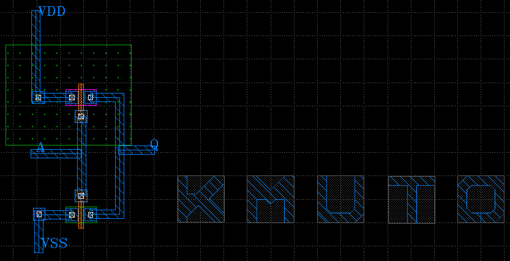

# インバータ回路ハンズオン

[ISHI会 2026年9月イベント：初めての半導体設計・製造体験！一日で作るインバータ回路ハンズオン](https://ishikai.connpass.com/event/407081/) で作成した回路図ファイルです。

## 回路図とレイアウト

入力 A、出力 Q。上が PMOS、下が NMOS。どちらも W=3.4µm、L=1µm。

| xschem | KLayout |
|:---:|:---:|
|  |  |

## 環境構築

開発環境は [ishi-kai/OpenEDA-PDK_SetupScript](https://github.com/ishi-kai/OpenEDA-PDK_SetupScript) の案内に従うこと。

Macの場合は、[VMware イメージ](https://www.noritsuna.jp/download/ISHI-Kai_EDA_vmware_OpenSUSI-TR10.tar.xz)を使うのが良さそう。

## 感想

TBD

## ファイル

- `inverter.sch`: xschem の回路図（PMOS / NMOS の CMOS インバータ）
- `inverter-simulation.sch`: DC 解析用のテストベンチ
- `inverter.gds`: レイアウト

## リンク

- [イベントページ](https://ishikai.connpass.com/event/407081/)
- [インバータの作り方（OpenSUSI-TR10）](https://github.com/ishi-kai/OpenEDA-PDK_SetupScript/blob/main/docs/inverter_OpenSUSI-TR10.pdf)
